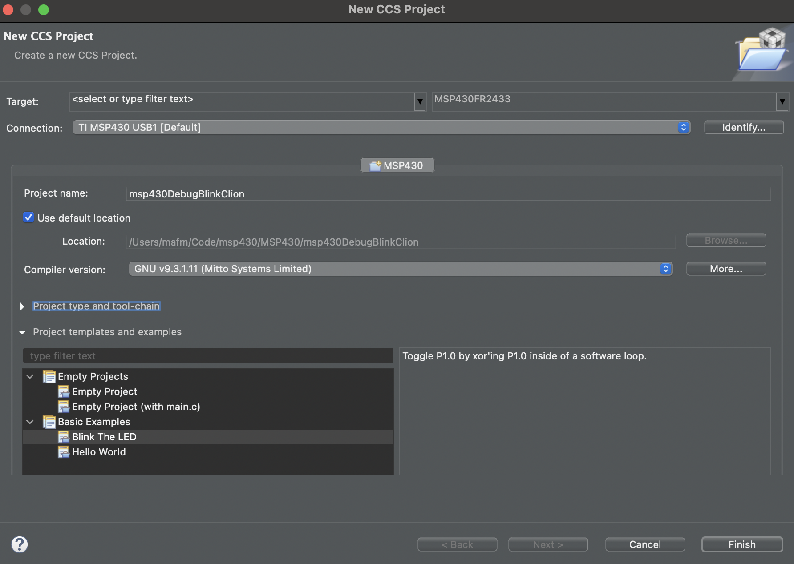
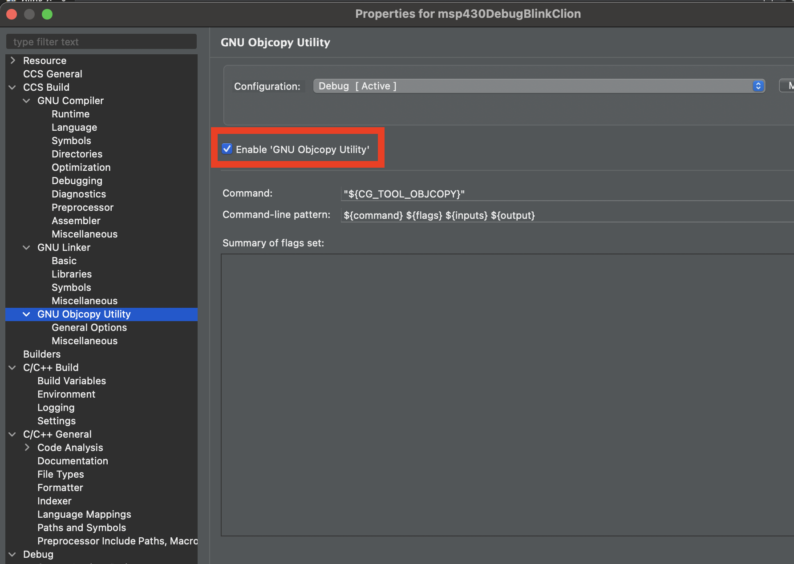
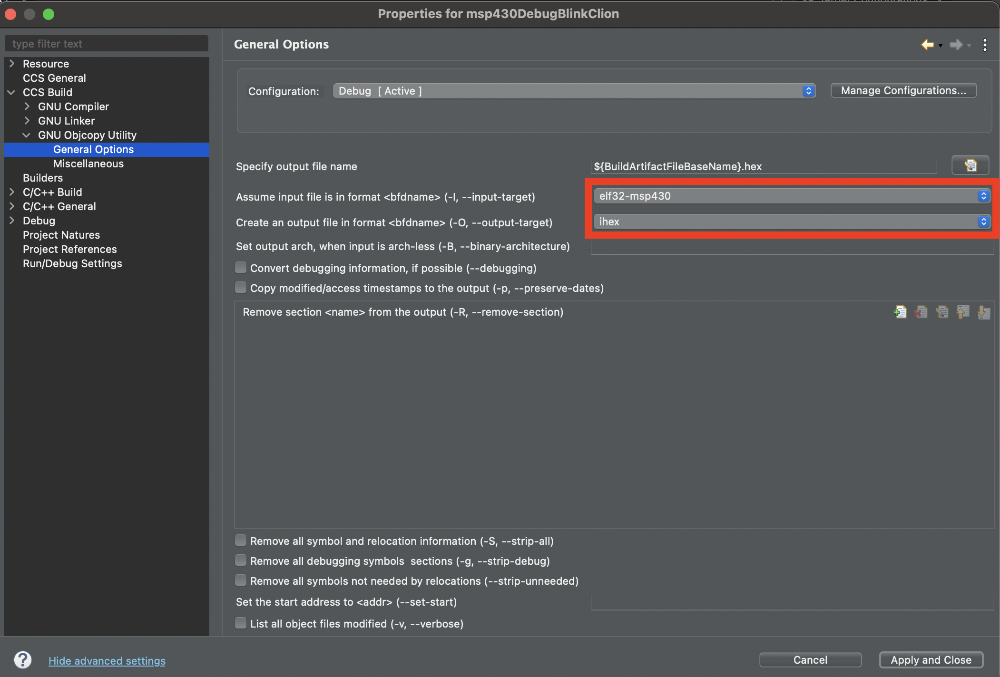
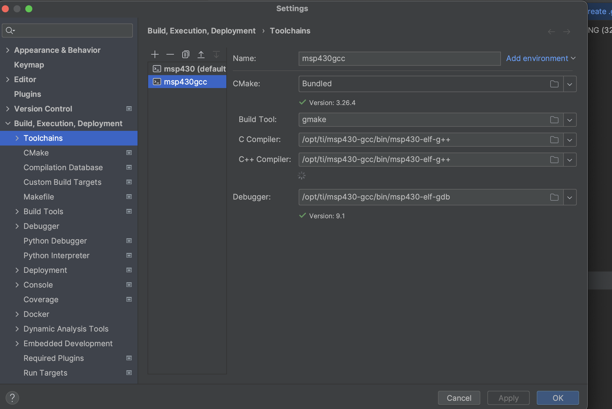
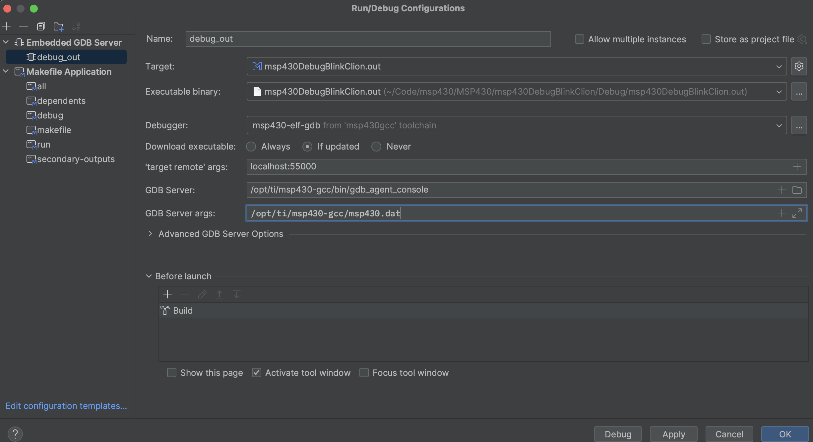
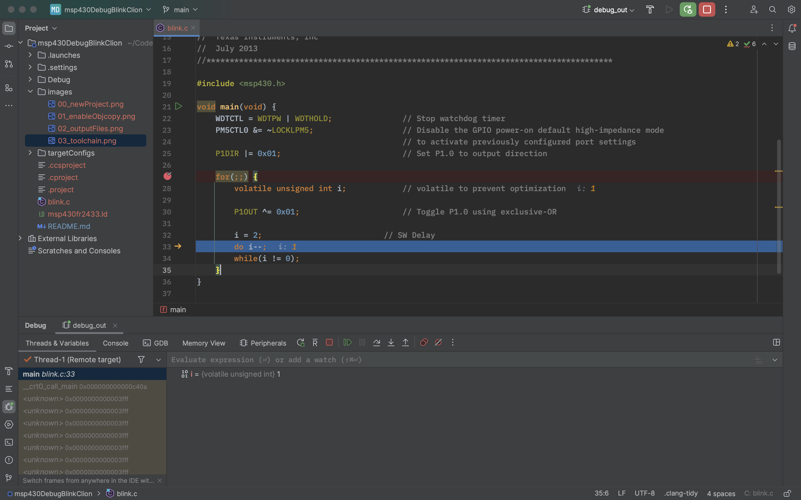

# msp430 Debug Blink with Clion

Template and instructions to debug msp430 using the gcc compiler and Clion

## Requirements

 * [CCSTUDIO](https://www.ti.com/tool/CCSTUDIO) to project generation. CSStudio generates a makefile that Clion can use to generate a project.
 * Install [Mitto Systems GCC macOS/linux/windows installer incl. support files](https://www.ti.com/tool/download/MSP430-GCC-OPENSOURCE/9.3.1.1).
 * A launchpad with debugger. In this example was used the [MSP-EXP430FR2433 launchpad](https://www.ti.com/tool/MSP-EXP430FR2433).
 * [MSP430Flasher](https://www.ti.com/tool/MSP430-FLASHER).

## Steps to Make it Work

Tested with macOS (M1).

1. Create a debug CSStudio project.
   
2. Configure compiler output files on project properties.
   
   
3. Run one (at least) the debug on CCStudio to generate makefile.
4. Open the project folder with Clion.
5. Import the makefile with Clion (file inside debug folder). I recommend to improve the make file to include options to flach the mcu (take a look to the code of this repo).
6. Configure the toolchain on Clion.
   
7. Configure Embedded GDB Server from Clion setting.
   
8. Done. Ready to debug.
   

## Useful Resources

 * [MSP430 GCC Toolchain User’s Guide](https://www.ti.com/lit/ug/slau646f/slau646f.pdf?ts=1696122855710&ref_url=https%253A%252F%252Fwww.google.com%252F)
 * [MSP Flasher User's Guide](https://www.ti.com/lit/ug/slau654e/slau654e.pdf?ts=1694985823973&ref_url=https%253A%252F%252Fwww.google.com%252F).
 * [GitHub repository from drvlas](https://github.com/drvlas/msp430-gcc-CLion-toolchain/tree/master). It's contains useful script to works and configure the debugger.
 * This guide is based on and created thanks to the drvlas's Blog: 
 ** [MSP430 + CLion. Part 1: Build](https://forum.allaboutcircuits.com/ubs/msp430-clion-part-1-build.1180/).
 ** [MSP430 + CLion. Part 2: Upload and Debug](https://forum.allaboutcircuits.com/ubs/msp430-clion-part-2-upload-and-debug.1181/).

